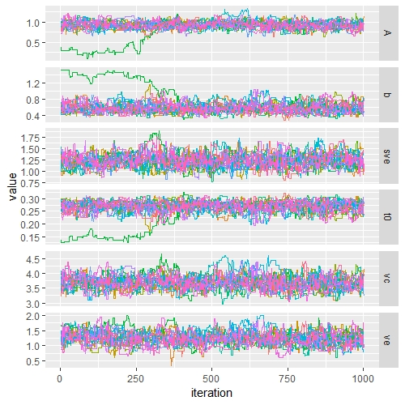
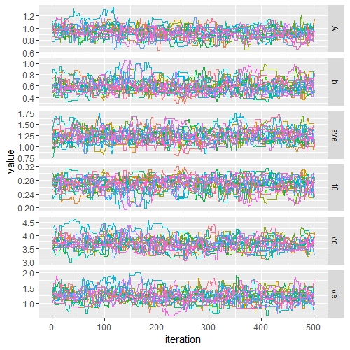
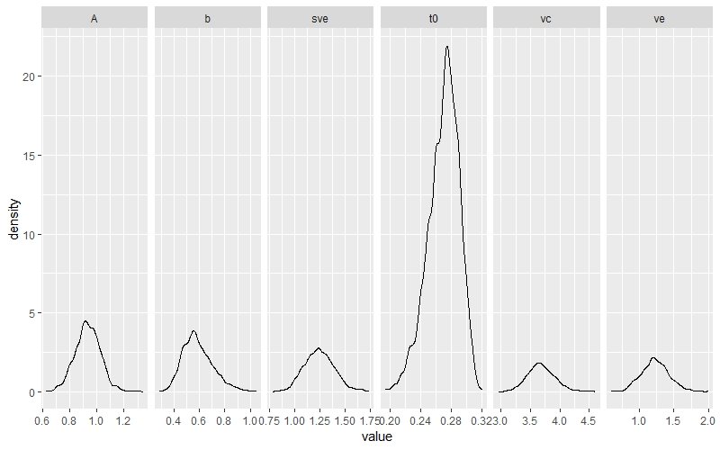

<!-- README.md is generated from README.Rmd. Please edit that file -->

## powder
**pow**er posteriors via **d**ifferential **e**volution in **r**

When presented with several competing formal models, one is required to select between these different explanations: a process commonly known as model selection. One of the more robust methods of performing model selection is through Bayes factors. `powder` estimates the Bayes factor via thermodynamic integration (Friel & Pettitt, 2008; Lartillot & Philippe, 2006) and steppingstone sampling (Xie, Lewis, Fan, Kuo, & Chen, 2011) by sampling from power posteriors using differential evolution MCMC. 

## Code
The underlying code that does DE-MCMC was initially developed by Brandon Turner, Scott Brown, Nathan Evans, and others (please contact me if I've left you out). `powder` extends this code to power posteriors and acts as a wrapper to make life easier.

## Install
```{r,eval=FALSE}
#install.packages('devtools')
devtools::install_github('jeff324/powder',build_vignettes = TRUE)
```

## Learn
View the tutorial on thermodynamic integration and steppingstone sampling.

```{r,eval=FALSE}
vignette("powder-lba")
```

The examples from the paper are also included as well as the paper itself (in revision).
```{r,eval=FALSE}
vignette("powder-paper-examples")
vignette("powder-paper")
```

## Use
Let's use `powder` to define an LBA model, obtain the power posteriors, and compute the estimates for the marginal likelihood. First, we define a simple LBA model where no parameters vary across conditions. We also include a contaminant process where 2% of the trials are due to random contaminants, defined by a uniform distribution between 0 and 5 seconds.

```{r}
library(powder)
model = LBA.Individual$new(contaminant = list(pct=2,upper.bound=5))
```

There are many other LBA models that can be defined, but for now we will stick with a simple one. Next, we load our data. This dataset is called "individual" and is a simulated dataset with a single subject from the LBA with two conditions in which no parameters were varied.

```{r,eval=FALSE}
data('individual')
```

Next, we will run the `powder` function to obtain the posterior samples. This runs Differential Evolution MCMC (Turner et al. 2014) over `num.temps` power posteriors, each containing `n.samples` samples after burning in `burnin` samples. It runs each power posterior sequentially, using the last sample of each power posterior as the starting point for the new power posterior. When switching to the next power posterior, it takes time to adapt. We have set the adaptation time to `meltin` iterations.

```{r,eval=FALSE}
pow.out = powder(data=individual, model = model, num.temps = 30, n.samples = 100, burnin=200, meltin = 50)
```

As described in Evans and Annis (submitted) we can increase the speed of the sampling process by sampling from power posteriors in parallel, where each chain in DE-MCMC samples from a different power posterior.

```{r,eval=FALSE}
pow.out.par = powder(data=individual, model = model, num.temps = 30, n.samples = 800, burnin=200, method='parallel')
```

Lastly, we can estimate the marginal likelihood with:

```{r,eval=FALSE}
summary(pow.out)

#                   Method         Value
# 1                     TI  5.618604e+02
# 2           TI Corrected  5.622093e+02
# 3          Harmonic Mean  5.757236e+02
# 4          Steppingstone 5.219464e+242
# 5      Log Steppingstone  5.621025e+02
# 6            TI Variance  2.653665e-03
# 7 Steppingstone Variance  2.263343e-02

summary(pow.out.par)

#                   Method         Value
# 1                     TI  5.628619e+02
# 2           TI Corrected  5.630752e+02
# 3          Harmonic Mean  5.739877e+02
# 4          Steppingstone 8.260357e+242
# 5      Log Steppingstone  5.628241e+02
# 6            TI Variance  3.445207e-03
# 7 Steppingstone Variance  4.691691e-02
```

The estimates from each method are similar to one another except for the harmonic mean and steppingstone estimator. The harmonic mean is generally considered a poor estimator of the marginal likelihood as it usually leads to an overestimate (Xie, et al. 2011). Note, the Steppingstone estimate will usually be very high or `NaN` because of overflow as it is estimating p(D) not ln(p(D)). These estimates are usually not stable, so one should use the log steppingstone estimate instead (Xie, et al. 2011).

### Posterior Estimation
powder can also be used to obtain posterior samples for parameter estimation.

```{r,eval=FALSE}
post.out = powder(data=individual, model=model, burnin=500, n.samples=1000, method='posterior')
```

We can plot the samples as a function of iteration to visually check for convergence.
```{r,eval=FALSE}
traceplot(post.out)
```

```{r, echo=FALSE, out.width = '50%'}

```

We can see there is a chain that is stuck until around 500 samples past our burnin phase. We can discard the first 500 samples so that the stuck chain does not influence our parameter estimates. We do this by increasing the `burnin` option to 1000.

```{r,eval=FALSE}
post.out$options$burnin = 1000
traceplot(post.out)
```

```{r, echo=FALSE, out.width = '50%'}

```

Now that we have a good sample, we can plot the densities.

```{r,eval=FALSE}
densplot(post.out)
```

```{r, echo=FALSE, out.width = '65%'}

```

## References

* Brown, S. D., & Heathcote, A. (2008). The simplest complete model of choice response time: Linear ballistic accumulation. Cognitive Psychology, 57(3), 153–178. http://doi.org/10.1016/j.cogpsych.2007.12.002

* Evans, N. J., & Brown, S. D. (2017). Bayes factors for the Linear Ballistic Accumulator Model of decision-making. Behavior Research Methods, Advance online publication.

* Friel, N., & Pettitt, A. N. (2008). Marginal likelihood estimation via power posteriors. Journal of the Royal Statistical Society. Series B: Statistical Methodology, 70(3), 589–607. 
http://doi.org/10.1111/j.1467-9868.2007.00650.x

* Friel, N., & Wyse, J. (2012). Estimating the evidence - A review. Statistica Neerlandica, 66(3), 288–308. http://doi.org/10.1111/j.1467-9574.2011.00515.x

* Lartillot, N., & Philippe, H. (2006). Computing Bayes factors using thermodynamic integration. Systematic Biology, 55(2), 195–207. http://doi.org/10.1080/10635150500433722

* Xie, W., Lewis, P. O., Fan, Y., Kuo, L., & Chen, M. H. (2011). Improving marginal likelihood estimation for bayesian phylogenetic model selection. Systematic Biology, 60(2), 150–160. http://doi.org/10.1093/sysbio/syq085


